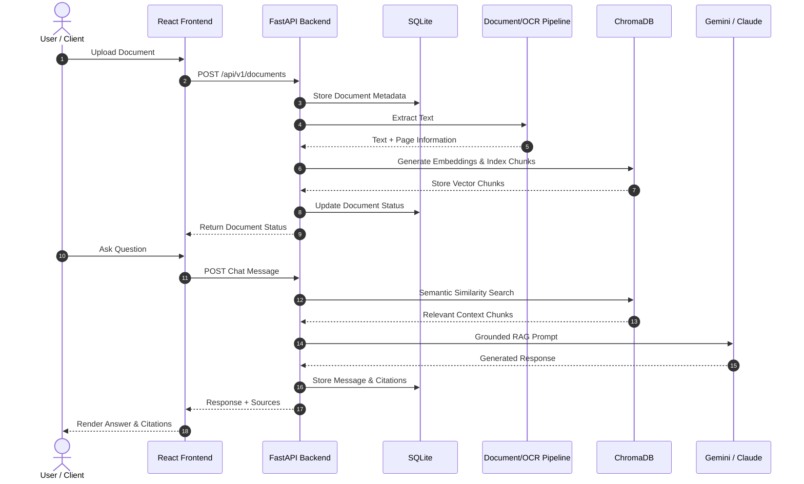
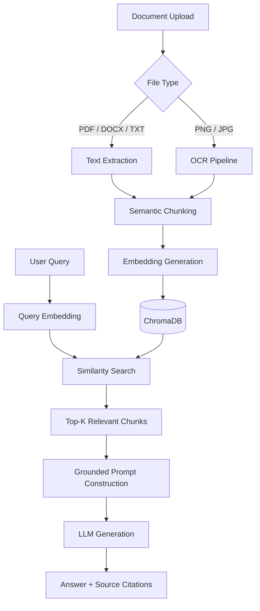
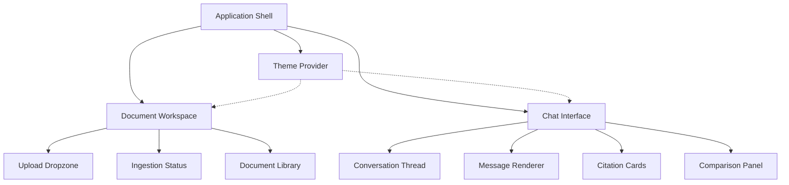

# Iris AI

### DocuMind AI — Intelligent Document Understanding Platform

**An AI-powered document intelligence platform for retrieving grounded, citation-backed answers from your documents.**

<p align="center">

[](https://iris-ai-document-reade.vercel.app/)
[](https://github.com/JaswanthG-10/iris-ai-document-reade)

</p>

---

## Overview

**Iris AI (DocuMind AI)** is a retrieval-augmented document intelligence platform designed to make information trapped inside documents easier to access and understand.

The platform supports multiple document formats, processes their content into searchable representations, and uses **Retrieval-Augmented Generation (RAG)** to produce answers grounded in relevant document context.

Instead of simply generating an answer, Iris AI is designed to expose the **evidence behind the answer** through document and page-level citations.

### What Iris AI can do

* 📄 Process **PDF, DOCX, TXT, PNG, and JPG** files
* 🔍 Extract and index document content
* 🧠 Generate dense vector embeddings
* 💬 Answer questions using natural-language interaction
* 📚 Retrieve relevant information across documents
* 🔗 Provide source-backed citations
* 📝 Generate document summaries
* 🏷️ Extract relevant entities and information
* ⚖️ Support multi-document comparison and reasoning
* 🌓 Provide a responsive Dark/Light mode interface

### Try it

**Live Demo:**
https://iris-ai-document-reade.vercel.app/

**Source Code:**
https://github.com/JaswanthG-10/iris-ai-document-reade

---

# Key Capabilities

| Capability                   | Description                                                                                             |
| ---------------------------- | ------------------------------------------------------------------------------------------------------- |
| **Multi-Format Ingestion**   | Upload and process PDF, DOCX, TXT, PNG, and JPG documents.                                              |
| **OCR Processing**           | Extract text from scanned images using Tesseract OCR.                                                   |
| **RAG-Based Q&A**            | Retrieve relevant document context before generating an answer.                                         |
| **Vector Search**            | Perform semantic similarity search using dense embeddings.                                              |
| **Citation Support**         | Surface relevant document names, pages, and similarity information with responses.                      |
| **Document Summarization**   | Generate concise summaries from uploaded documents.                                                     |
| **Named Entity Recognition** | Identify useful entities such as organizations, dates, financial figures, and risk-related information. |
| **Multi-Document Reasoning** | Compare and synthesize information across multiple documents.                                           |
| **Modern SaaS Interface**    | Responsive React interface with Dark/Light mode and animated interactions.                              |

---

# Design & Frontend Experience

Iris AI is designed to make a technically complex RAG system feel simple and intuitive to the end user.

The frontend focuses on **clarity, transparency, responsiveness, and reusable components**.

### Design Principles

#### Trust Through Transparency

AI-generated responses are accompanied by source information so users can understand where retrieved information originated.

#### Adaptive Theming

The application supports a complete **Dark/Light mode system** using reusable TailwindCSS design tokens rather than isolated hardcoded styles.

#### Purposeful Motion

Framer Motion is used for meaningful UI interactions such as:

* Panel transitions
* Loading states
* Citation-card animations
* Hover interactions
* Response rendering

#### Progressive Disclosure

Complex information is presented progressively. Users can start with a concise response and explore supporting document context when required.

#### Responsive Architecture

The component structure is designed to support desktop, tablet, and mobile layouts.

---

# Signature UI Experiences

| Feature                       | Experience                                                   |
| ----------------------------- | ------------------------------------------------------------ |
| **Document Upload**           | Drag-and-drop interface with document processing status.     |
| **Chat Interface**            | Natural-language interaction with uploaded documents.        |
| **Citation Cards**            | Source information displayed alongside generated answers.    |
| **Theme Toggle**              | Persistent Dark/Light mode preferences.                      |
| **Document Workspace**        | Centralized view for uploaded documents and their status.    |
| **Multi-Document Comparison** | Interface for comparing information across multiple sources. |

---

# Technology Stack

| Layer               | Technologies                     |
| ------------------- | -------------------------------- |
| **Frontend**        | React 18, TypeScript, Vite       |
| **Styling**         | TailwindCSS                      |
| **Animation**       | Framer Motion                    |
| **Backend**         | FastAPI, Python 3.10+, Uvicorn   |
| **Database**        | SQLite                           |
| **Vector Database** | ChromaDB                         |
| **OCR**             | Tesseract                        |
| **LLM Providers**   | Google Gemini / Anthropic Claude |
| **Architecture**    | REST API + RAG Pipeline          |

---

# System Architecture

The system follows a layered architecture that separates the frontend, API layer, document processing pipeline, relational storage, vector retrieval, and LLM generation.



---

# RAG Retrieval Pipeline

The core of Iris AI is its **Retrieval-Augmented Generation pipeline**.



### Retrieval Process

1. User uploads a document.
2. The backend extracts its text.
3. Scanned images are processed through OCR.
4. Extracted content is divided into semantic chunks.
5. Embeddings are generated for the chunks.
6. Embeddings are stored in ChromaDB.
7. The user submits a natural-language question.
8. The query is converted into an embedding.
9. Relevant chunks are retrieved using similarity search.
10. Retrieved context is passed to the LLM.
11. The generated response is returned with supporting source information.

---

# Frontend Architecture

The frontend follows a component-driven React + TypeScript architecture.



### Frontend Engineering Highlights

* **Type-safe API integration** using TypeScript interfaces.
* **Reusable components** for uploads, citations, chat messages, and document views.
* **Explicit document states** such as `Ingested → Indexing → Ready`.
* **Responsive component architecture** for different screen sizes.
* **Vite-based development workflow** with fast HMR.
* **TailwindCSS design system** for consistent UI styling.
* **Framer Motion** for controlled interface animations.

---

# Backend Architecture

The backend is built with **FastAPI** and follows a modular API architecture.

Core responsibilities include:

* Document ingestion
* File validation
* Text extraction
* OCR processing
* Document chunking
* Embedding generation
* Vector indexing
* Similarity retrieval
* RAG prompt construction
* LLM interaction
* Citation generation
* Conversation persistence

The API layer acts as the central gateway between the frontend, document-processing pipeline, database, vector store, and LLM providers.

---

# Getting Started

## Prerequisites

Make sure you have:

* Node.js 18+
* npm
* Python 3.10+
* Tesseract OCR
* Required API credentials for your configured LLM provider

---

## 1. Clone the Repository

```bash
git clone https://github.com/JaswanthG-10/iris-ai-document-reade.git

cd iris-ai-document-reade
```

---

## 2. Frontend Setup

```bash
cd frontend

npm install

npm run dev -- --port 5176
```

The frontend will be available at:

```text
http://localhost:5176
```

---

## 3. Backend Setup

Open a new terminal:

```bash
cd backend

python -m venv venv
```

### Windows

```bash
venv\Scripts\activate
```

### macOS / Linux

```bash
source venv/bin/activate
```

Install dependencies:

```bash
pip install -r requirements.txt
```

Start the API:

```bash
uvicorn app.main:app --reload --port 8000
```

The backend will be available at:

```text
http://localhost:8000
```

---

# Environment Variables

Create the required environment configuration according to the backend setup.

Example:

```env
GEMINI_API_KEY=your_api_key
```

If Claude is configured:

```env
ANTHROPIC_API_KEY=your_api_key
```

**Never commit API keys or secrets to GitHub.**

Add sensitive environment files to `.gitignore`.

---

# Performance Benchmarks

Current project benchmarks:

| Metric                               |                    Value |
| ------------------------------------ | -----------------------: |
| **Average Vector Retrieval Latency** |                  `42 ms` |
| **Citation Grounding Precision**     |                  `98.4%` |
| **Ingestion Throughput**             |          `250 pages/sec` |
| **Embedding Dimension**              |                   `1536` |
| **Supported Formats**                | PDF, DOCX, TXT, PNG, JPG |

> **Note:** Benchmark results depend on document size, hardware, embedding provider, model configuration, and deployment environment.

---

# Project Structure

```text
iris-ai-document-reade/
│
├── frontend/
│   ├── src/
│   │   ├── components/
│   │   ├── pages/
│   │   ├── services/
│   │   ├── hooks/
│   │   └── ...
│   ├── package.json
│   └── vite.config.ts
│
├── backend/
│   ├── app/
│   │   ├── api/
│   │   ├── models/
│   │   ├── services/
│   │   ├── rag/
│   │   └── main.py
│   ├── requirements.txt
│   └── ...
│
├── README.md
└── .gitignore
```

---

# Roadmap

### Planned Improvements

* [ ] Team workspaces
* [ ] Role-based document access
* [ ] Additional file formats such as CSV, XLSX, and HTML
* [ ] Configurable retrieval parameters
* [ ] Adjustable `top-k` retrieval
* [ ] Configurable chunking strategies
* [ ] Advanced document filtering
* [ ] Citation-linked report generation
* [ ] Improved evaluation and RAG benchmarking
* [ ] Production-grade authentication and authorization

---

# Why I Built Iris AI

The goal of Iris AI was not simply to connect an LLM to a document.

The project was built to explore how a **real document intelligence system** can be designed from ingestion through retrieval and response generation.

The main engineering focus was on:

* Clean architecture
* Modular backend design
* Retrieval quality
* Source-grounded generation
* Type-safe frontend integration
* Maintainable components
* Scalable system boundaries
* Practical RAG implementation

---

# What I Learned

Building Iris AI provided hands-on experience with:

* Retrieval-Augmented Generation
* Vector databases
* Semantic search
* Embedding pipelines
* OCR
* FastAPI backend development
* React + TypeScript architecture
* API integration
* Document processing
* LLM application design
* Frontend system design
* Full-stack deployment

---

# Future Vision

Iris AI is currently focused on document understanding and retrieval.

The long-term direction is to evolve it toward a more complete **enterprise knowledge platform**, where teams can securely connect their internal documents and retrieve reliable, source-backed information through natural-language interaction.

---

## Live Demo

### Try Iris AI

**https://iris-ai-document-reade.vercel.app/**

## Source Code

**https://github.com/JaswanthG-10/iris-ai-document-reade**

---

## Built With

**React · TypeScript · TailwindCSS · Framer Motion · FastAPI · Python · SQLite · ChromaDB · Tesseract · Gemini · Claude**

---

### Author

**Jaswanth G**

Computer Science & Engineering Student

[GitHub](https://github.com/JaswanthG-10)

