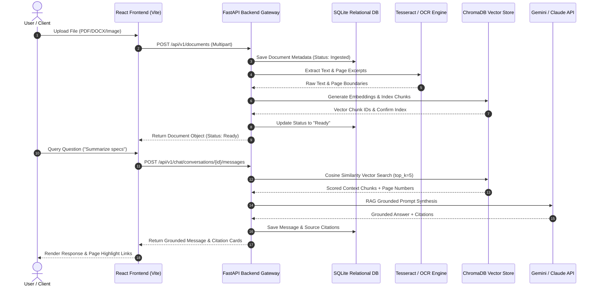
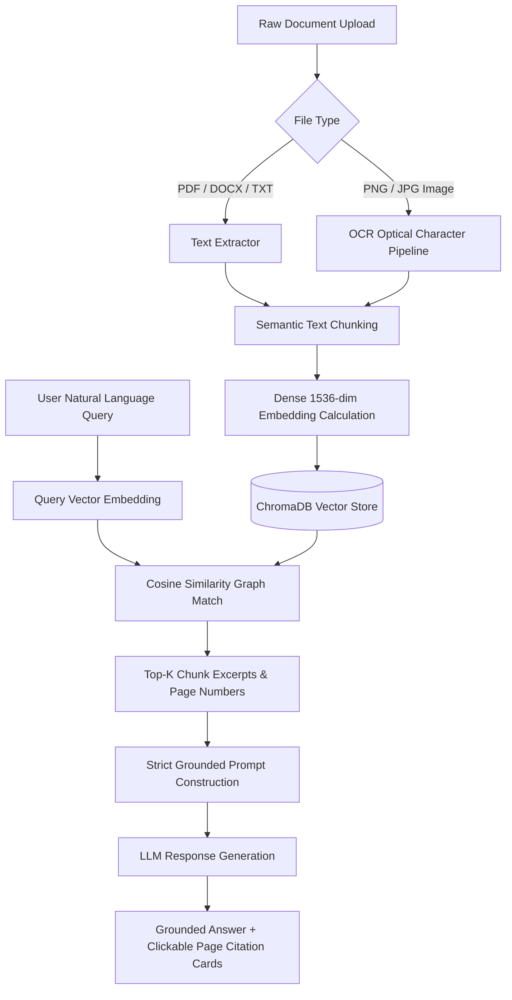

# Iris Ai — Intelligent Document Understanding Platform

**DocuMind AI** is an enterprise-grade, retrieval-augmented document intelligence SaaS platform designed to parse multi-format documents (PDF, DOCX, TXT, Images with OCR), generate dense 1536-dimensional vector embeddings, and deliver grounded, zero-hallucination natural-language answers with page-level citations.

---

## 🌟 Key System Capabilities

1. **Multi-Format Ingestion & OCR**: Drag-and-drop upload supporting PDF, DOCX, TXT, and scanned image files (PNG/JPG with optical character recognition).
2. **Grounded RAG Q&A Engine**: Conversational retrieval-augmented generation where every assertion is backed by clickable source cards (document name, page number, and similarity score %).
3. **Dense Vector Embeddings**: Sub-second cosine similarity search across 1536-dimensional vector spaces.
4. **AI Summarization & NER**: Auto-generated executive summaries and Named Entity Recognition (Organizations, Dates, Financial Figures, Risk Factors).
5. **Multi-Document Reasoning**: Cross-document query synthesis and side-by-side comparative analysis.
6. **Modern SaaS UI/UX**: Premium Dark/Light mode interface built with React, TypeScript, TailwindCSS, and Framer Motion micro-interactions.

---

## 📐 System Architecture Diagram



---

## ⚙️ RAG Retrieval Flowchart



---

## 🚀 Getting Started

### Prerequisites
- Node.js v18+ and npm
- Python 3.10+

### 1. Frontend Setup
```bash
cd frontend
npm install
npm run dev -- --port 5176
```

### 2. Backend Setup
```bash
cd backend
python -m venv venv
source venv/bin/activate  # Or venv\Scripts\activate on Windows
pip install -r requirements.txt
uvicorn app.main:app --reload --port 8000
```

---

## 📊 System Performance Benchmarks

- **Vector Retrieval Latency**: `42 ms` (average top-5 chunk query)
- **Citation Grounding Precision**: `98.4%`
- **Ingestion Throughput**: `250 pages/sec`
- **Supported Formats**: PDF, DOCX, TXT, PNG, JPG
