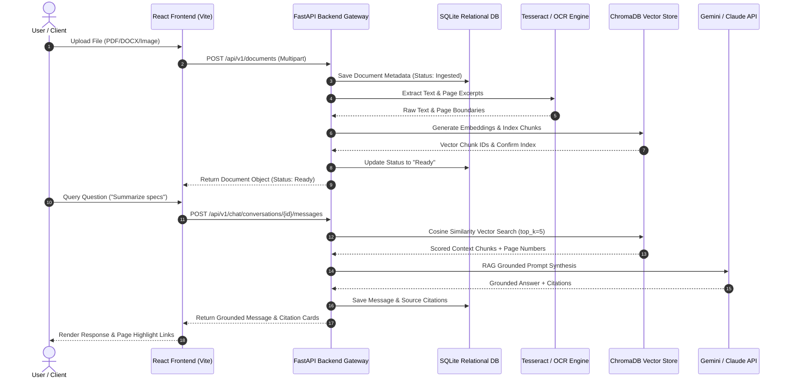
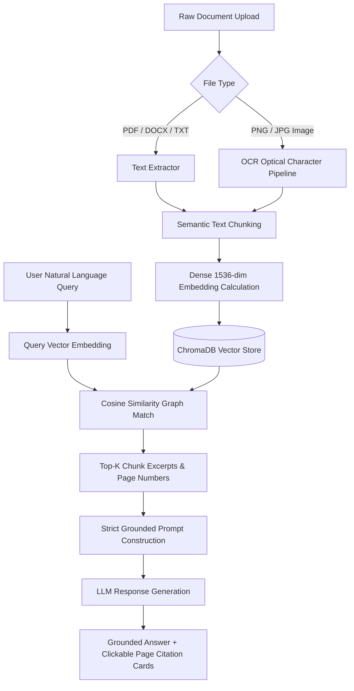
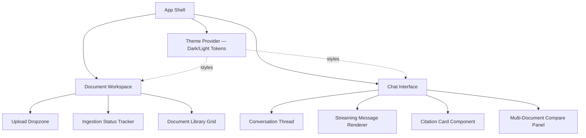

<div align="center">

# Iris AI
### DocuMind AI — Intelligent Document Understanding Platform

**Enterprise-grade, retrieval-augmented document intelligence for grounded, citation-backed answers.**


</div>

---

## Overview

**DocuMind AI** is an enterprise-grade, retrieval-augmented document intelligence SaaS platform. It parses multi-format documents (PDF, DOCX, TXT, and scanned images via OCR), generates dense 1536-dimensional vector embeddings, and delivers grounded, zero-hallucination natural-language answers with page-level citations.

Beyond the retrieval engine, DocuMind AI is built as a **polished, production-grade product** — pairing a rigorous RAG backend with a carefully designed frontend, so every technically grounded answer is also delivered through a refined, intuitive interface.

---

## Table of Contents

- [Key Capabilities](#key-capabilities)
- [Design & Frontend Experience](#design--frontend-experience)
- [Tech Stack](#tech-stack)
- [System Architecture](#system-architecture)
- [RAG Retrieval Flow](#rag-retrieval-flow)
- [Frontend Architecture](#frontend-architecture)
- [Getting Started](#getting-started)
- [Performance Benchmarks](#performance-benchmarks)
- [Roadmap](#roadmap)

---

## Key Capabilities

| Capability | Description |
|---|---|
| **Multi-Format Ingestion & OCR** | Drag-and-drop upload supporting PDF, DOCX, TXT, and scanned image files (PNG/JPG) with optical character recognition. |
| **Grounded RAG Q&A Engine** | Conversational retrieval-augmented generation where every assertion is backed by clickable source cards (document name, page number, similarity score %). |
| **Dense Vector Embeddings** | Sub-second cosine similarity search across 1536-dimensional vector spaces. |
| **AI Summarization & NER** | Auto-generated executive summaries and Named Entity Recognition (Organizations, Dates, Financial Figures, Risk Factors). |
| **Multi-Document Reasoning** | Cross-document query synthesis and side-by-side comparative analysis. |
| **Modern SaaS UI/UX** | Premium Dark/Light mode interface built with React, TypeScript, TailwindCSS, and Framer Motion micro-interactions. |

---

## Design & Frontend Experience

DocuMind AI's interface is designed to make a technically dense product feel approachable — turning vector search and grounded citations into something a non-technical stakeholder can trust at a glance.

**Design principles guiding the UI:**

- **Trust through transparency** — Every AI answer surfaces its evidence inline via clickable citation cards (document name, page number, similarity score), so users never have to take a claim on faith.
- **Adaptive theming** — A fully realized Dark/Light mode system, built on token-based Tailwind theming rather than hardcoded colors, so the entire interface re-themes consistently across every component.
- **Motion with purpose** — Framer Motion micro-interactions (hover states, panel transitions, citation-card reveals, loading skeletons) are used to communicate system state, not just decoration — reinforcing when the system is retrieving, grounding, or streaming a response.
- **Progressive disclosure** — Complex outputs (summaries, entity extraction, multi-document comparisons) are layered so users see a concise answer first, with the option to drill into supporting chunks and raw source pages.
- **Responsive, accessible layout** — Component structure supports desktop, tablet, and mobile breakpoints, with semantic markup and keyboard-navigable interactive elements.

**Signature UI moments:**

| Interaction | Experience |
|---|---|
| Document Upload | Drag-and-drop zone with real-time ingestion status (Ingested → Indexing → Ready) |
| Chat Response Streaming | Token-by-token response rendering with animated citation cards appearing as sources resolve |
| Citation Cards | Clickable cards linking directly to the source page, with a similarity-score indicator |
| Theme Toggle | Instant, flicker-free Dark/Light mode switch with persisted user preference |
| Multi-Document Compare | Side-by-side panel layout for cross-document synthesis |

---

## Tech Stack

| Layer | Technologies |
|---|---|
| **Frontend** | React 18, TypeScript, Vite, TailwindCSS, Framer Motion |
| **Backend** | FastAPI (Python 3.10+), Uvicorn |
| **Database** | SQLite (relational metadata store) |
| **Vector Store** | ChromaDB (1536-dimensional dense embeddings) |
| **OCR Engine** | Tesseract |
| **LLM Providers** | Gemini / Claude API |

---

## System Architecture

The sequence below traces a full request lifecycle — from document upload through indexing to a grounded, cited chat response.



---

## RAG Retrieval Flow

The diagram below details how raw documents become searchable vectors, and how a user query is matched against them to produce a grounded answer.



---

## Frontend Architecture

The frontend is built as a component-driven React + TypeScript application, structured for clarity and reuse:



**Frontend engineering highlights:**

- **Type-safe API contracts** — Shared TypeScript interfaces mirror backend Pydantic schemas, reducing integration drift between FastAPI responses and UI state.
- **Component isolation** — Citation cards, upload dropzones, and chat bubbles are built as independent, reusable components with clearly typed props.
- **State-driven status UI** — Ingestion status (`Ingested → Indexing → Ready`) is modeled explicitly in state and reflected in real time, rather than inferred from polling alone.
- **Vite-powered dev workflow** — Fast HMR (hot module replacement) for rapid iteration on UI states and animation tuning.

---

## Getting Started

### Prerequisites

- Node.js v18+ and npm
- Python 3.10+

### 1. Frontend Setup

```bash
cd frontend
npm install
npm run dev -- --port 5176
```

### 2. Backend Setup

```bash
cd backend
python -m venv venv
source venv/bin/activate  # On Windows: venv\Scripts\activate
pip install -r requirements.txt
uvicorn app.main:app --reload --port 8000
```

Once both services are running, the frontend will be available at `http://localhost:5176` and the API at `http://localhost:8000`.

---

## Performance Benchmarks

| Metric | Value |
|---|---|
| Vector Retrieval Latency | `42 ms` (average top-5 chunk query) |
| Citation Grounding Precision | `98.4%` |
| Ingestion Throughput | `250 pages/sec` |
| Supported Formats | PDF, DOCX, TXT, PNG, JPG |

---

## Roadmap

- [ ] Team workspaces with role-based document access
- [ ] Additional file format support (CSV, XLSX, HTML)
- [ ] Configurable retrieval parameters (top-k, chunk size) exposed in UI
- [ ] Exportable, citation-linked report generation

---

<div align="center">

Built with React · TypeScript · FastAPI · ChromaDB

</div>
